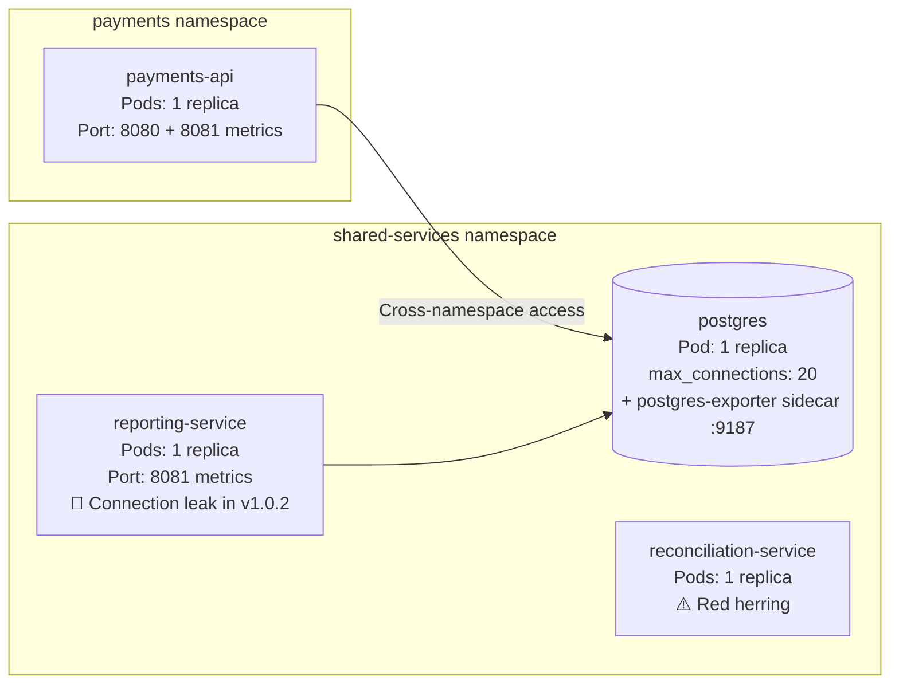

# Demo Scenario: Cross-Namespace Connection Leak via Version Rollout

## Overview

A realistic failure scenario deployed on OpenShift, designed to demonstrate how a routine service upgrade can introduce a subtle database connection leak that exhausts shared infrastructure across namespaces. The reporting service rolls from a healthy v1.0.1 to a buggy v1.0.2 that never closes database connections, rapidly filling PostgreSQL's connection pool (max 20) and causing the payments API in a separate namespace to fail with HTTP 503 errors. The AI assistant must correlate the deployment event with the cross-namespace failure and trace the connection leak to its source.

## Architecture

**Namespaces:** `shared-services` and `payments`



| Service | Image | Replicas | Purpose |
|---------|-------|----------|---------|
| `payments-api` | Custom (Python/FastAPI) | 1 | Core payment processing API. Runs a background traffic simulator and exposes `GET /api/v1/process-payment`. **Appears independent but shares database.** |
| `reporting-service` | Custom (Python) | 1 | Periodically queries the reports table. Has two versions: v1.0.1 (healthy) and v1.0.2 (buggy). |
| `reconciliation-service` | `registry.redhat.io/rhel9/httpd-24:latest` (stock) | 1 | Reconciliation service. **Red herring** — overridden command exits immediately, always in CrashLoopBackOff. |
| `postgres` | `postgres:16` + `postgres-exporter:v0.15.0` sidecar | 1 | Shared database for both services. Initialized with `max_connections = 20`. Sidecar exposes connection metrics on port 9187. |

## The Root Cause

A deployment rollout updates the reporting service from v1.0.1 to v1.0.2, which introduces a connection leak bug:

```python
# The bug in reporting-service v1.0.2
def run():
    connections = []              # Unbounded list — connections accumulate forever
    while True:
        try:
            conn = psycopg2.connect(DSN)
            connections.append(conn)  # Connection stored but never removed
            cur = conn.cursor()
            cur.execute("SELECT count(*) FROM reports")
            total = cur.fetchone()[0]
            avg = total / 0           # Division by zero — jumps to except
            # cur.close()             # ❌ Never reached
            # conn.close()            # ❌ Never reached
        except Exception as e:
            log.error("Failed to process pending reports: %s", e)
        time.sleep(10)               # Every 10 seconds (was 60 in v1.0.1)
```

### The Backstory

**Timeline: Routine version rollout**

The development team deployed v1.0.2 of the reporting service with "optimized" query intervals (reduced from 60s to 10s). During the refactor, two problems were introduced:

1. **The division-by-zero bug**: A computation `total / 0` always raises an exception, causing the code to skip the connection cleanup on every iteration
2. **Connections stored in a list**: Each iteration appends a new connection that is never closed or removed

**Testing gap:** The bug is in the error handling path. The happy-path cleanup code (`cur.close()` / `conn.close()`) is commented out and unreachable due to the exception.

**Result:** The reporting service leaks 1 database connection every 10 seconds. With PostgreSQL's `max_connections = 20`, the pool is exhausted in roughly 3 minutes.

## The Cascade

```
T+0:00   break.sh runs — reporting-service rolls out v1.0.2
T+0:10   First connection leaked (division by zero, connection not closed)
T+0:20   Second connection leaked
T+1:00   ~6 connections leaked
T+2:00   ~12 connections leaked, pool pressure building
T+3:00   ~18 connections leaked, pool nearly exhausted
T+3:20   Pool exhausted — PostgreSQL refuses new connections
T+3:30   payments-api traffic simulator and API both fail with HTTP 503
T+3:30   PaymentErrorRateHigh alert fires (warning at >10%, critical at >50%)
T+4:00+  Continuous 503 failures until fix.sh rolls back to v1.0.1
```

**Result: Payment processing completely fails. The root cause is in a different namespace.**

## Why This Scenario Is Hard

- **For humans:** An SRE sees payment processing 503 errors and naturally focuses on the payment service. The reporting service appears unrelated (different namespace, different purpose). Discovering the shared database dependency requires understanding the infrastructure layout.

- **For rule-based correlation:** Traditional correlation tools focus on service-level dependencies within namespaces. The cross-namespace database sharing isn't captured in standard dependency graphs. The failure correlates with a deployment event in a different namespace.

- **For naive AI grouping:** The AI must recognize that services in different namespaces can share infrastructure, correlate the reporting-service rollout timing with payment failures, and identify the connection leak pattern in the v1.0.2 source code.

- **Red herring**: The reconciliation-service in the shared-services namespace is in CrashLoopBackOff (bad command override). A crash-looping pod in the same namespace as the database tempts the investigator to link it to the connection exhaustion — but it's completely unrelated. Fires `SharedServicesPodCrashLooping` and `SharedServicesDeploymentReplicasMismatch` alerts.

## Demo Script / Narrative

### Setting the Scene

> "A routine version rollout just deployed v1.0.2 of the reporting service. This service runs in the shared-services namespace and periodically queries a reports table — it seems completely independent from the payment processing system running in the payments namespace."

### What Actually Happened

> "Version 1.0.2 introduced a subtle bug: a division by zero on every query iteration causes the code to skip connection cleanup. Connections are appended to a list but never closed. With the query interval reduced from 60 to 10 seconds, the database connection pool (max 20) fills up in about 3 minutes.
>
> The payments API shares the same PostgreSQL database across namespaces — something not immediately obvious from the namespace layout."

### What the AI Needs to Figure Out

1. **Recognize cross-namespace dependencies**: Both services connect to the same PostgreSQL instance
2. **Correlate deployment timing**: The reporting-service rollout preceded the payment failures
3. **Identify the connection leak**: The v1.0.2 code never closes connections due to the exception path
4. **Trace shared resources**: The `DATABASE_URL` environment variables point to the same database

## Usage

### Prerequisites

- OpenShift 4.x cluster
- `oc` CLI logged in with appropriate permissions
- Container images available at `quay.io/afalossi/demo6-*` (pre-built)

### Build images (optional)

```bash
make update-images
```

Builds and pushes `reporting-service:v1.0.1`, `reporting-service:v1.0.2`, and `payments-api:v1.0.1`.

### Deploy (healthy state)

```bash
make deploy
```

This deploys:
- Enables user workload monitoring (required for custom PrometheusRules)
- PostgreSQL database in `shared-services` namespace (max_connections=20)
- `reporting-service` (healthy v1.0.1) in `shared-services` namespace
- `reconciliation-service` in `shared-services` namespace (bad command override — immediately enters CrashLoopBackOff)
- `payments-api` in `payments` namespace with a Route

### Trigger the failure

```bash
make break
```

Rolls out `reporting-service` to v1.0.2, which has the connection leak bug. Failure manifests within ~3 minutes.

### Fix red herring

```bash
make fix-redherring
```

Removes the bad command override so reconciliation-service can start normally.

### Re-introduce red herring

```bash
make break-redherring
```

Patches reconciliation-service with a bad command, returning it to CrashLoopBackOff.

### Restore healthy state

```bash
make fix
```

Rolls back the reporting service to v1.0.1.

### Full cleanup

```bash
make cleanup
```

Deletes both namespaces and all demo resources.

## Prometheus Monitoring

All services expose Prometheus metrics, collected via ServiceMonitors (requires user workload monitoring enabled by `deploy.sh`).

| Component | Metrics Port | Key Metrics |
|-----------|-------------|-------------|
| `payments-api` | 8081 | `http_requests_total{handler, method, status}` |
| `reporting-service` | 8081 | `reporting_queries_total`, `reporting_active_connections`, `reporting_query_duration_seconds` |
| `postgres-exporter` (sidecar) | 9187 | `connections_total`, `max_connections`, connection states |

### Alerts

**`shared-services` namespace** ([05-prometheusrules.yaml](manifests/shared-services/05-prometheusrules.yaml)):
- `SharedServicesPodCrashLooping` — fires for reconciliation-service (red herring)
- `SharedServicesDeploymentReplicasMismatch` — fires for reconciliation-service (red herring)
- `PostgresqlConnectionsHigh` (warning) — connections > 9
- `PostgresqlTooManyConnections` (critical) — connections > 13

**`payments` namespace** ([03-monitoring.yaml](manifests/payments/03-monitoring.yaml)):
- `PaymentErrorRateHigh` (warning) — error rate > 3%
- `PaymentErrorRateHigh` (critical) — error rate > 15%

## Monitoring the Failure

### Service Health
```bash
# Watch pods across both namespaces
oc get pods -n shared-services -w
oc get pods -n payments -w

# Test the payment API
ROUTE=$(oc -n payments get route payments-api -o jsonpath='{.spec.host}')
curl http://${ROUTE}/api/v1/process-payment
```

### Database Connection Analysis
```bash
# Current connection count
oc exec -n shared-services deployment/postgres -- \
  psql -U demo -d demo \
  -c "SELECT count(*) AS total_connections FROM pg_stat_activity;"

# Connection breakdown by application
oc exec -n shared-services deployment/postgres -- \
  psql -U demo -d demo \
  -c "SELECT application_name, state, count(*) FROM pg_stat_activity GROUP BY application_name, state;"
```

### Service Logs
```bash
# Reporting service logs (look for "Failed to process pending reports" errors)
oc logs -n shared-services deployment/reporting-service -f

# Payments API logs (look for "Database connection failed" errors)
oc logs -n payments deployment/payments-api -f
```

## File Structure

```
demo6/
├── Makefile                          # Make targets for all scripts
├── scripts/
│   ├── update-images.sh              # Build and push container images
│   ├── deploy.sh                     # Deploy healthy state
│   ├── break.sh                      # Roll out buggy v1.0.2
│   ├── fix.sh                        # Roll back to v1.0.1
│   ├── break-redherring.sh           # Introduce red herring (CrashLoopBackOff)
│   ├── fix-redherring.sh             # Fix red herring (correct liveness probe port)
│   ├── delete-history.sh             # Delete Prometheus TSDB and restart pods
│   └── cleanup.sh                    # Delete all demo resources
├── README.md                         # This file
├── CLAUDE.md                         # AI assistant context
├── manifests/
│   ├── payments/
│   │   ├── 00-namespace.yaml         # Payments namespace
│   │   ├── 01-secrets.yaml           # payments-db Secret
│   │   ├── 02-payments-api.yaml      # Deployment + Service + Route
│   │   └── 03-monitoring.yaml        # ServiceMonitor + PaymentErrorRateHigh alerts
│   └── shared-services/
│       ├── 00-namespace.yaml         # Shared-services namespace
│       ├── 01-secrets.yaml           # postgres-admin + reporting-db Secrets
│       ├── 02-postgres.yaml          # PostgreSQL + init ConfigMap + PVC
│       ├── 03-reporting-service.yaml # Reporting service deployment
│       ├── 04-reconciliation-service.yaml # Reconciliation service (red herring)
│       └── 05-prometheusrules.yaml   # ServiceMonitors + alert rules for shared-services
├── payments-api/
│   ├── Dockerfile
│   ├── app.py                        # FastAPI app + background traffic simulator
│   └── requirements.txt
└── reporting-service/
    ├── v1.0.1/                       # Healthy: properly closes connections
    │   ├── Dockerfile
    │   ├── app.py
    │   └── requirements.txt
    └── v1.0.2/                       # Buggy: connection leak
        ├── Dockerfile
        ├── app.py
        └── requirements.txt
```

## Educational Value

This demo teaches:
- **Version rollout failures** — Not all failures come from config changes; code bugs in new versions can cause cascading failures
- **Cross-namespace dependencies** — Services that appear independent can share critical infrastructure
- **Connection leak mechanics** — How database connection pools exhaust and cause cascading service failures
- **Error path testing** — The bug lives in the exception handling path, highlighting the importance of testing error scenarios
- **Temporal correlation** — Connecting symptoms to deployment events across namespace boundaries
